# Analysis of performance of Load Balancer

## A-1

Results of 10000 async requests on N = 3 servers:

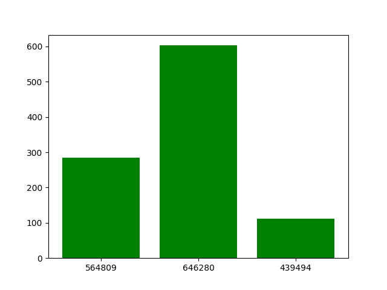

In the various tests we ran on the system, we found that more requests seemed to be skewed to one of the servers for the given hash-functions. However occasionally the load was balanced somewhat due to the consistent hashing data structure.

## A-2

<!-- {'989403': 2554, '500494': 7446}
{'422261': 4128, '707281': 2405, '991684': 3467}
{'358773': 4251, '232040': 2998, '666819': 1521, '498061': 1230}
{'491779': 1478, '996199': 1983, '129648': 3496, '822559': 1988, '926487': 1055}
{'130390': 1994, '721951': 2848, '139521': 2047, '319109': 764, '249462': 1732, '476433': 615} -->

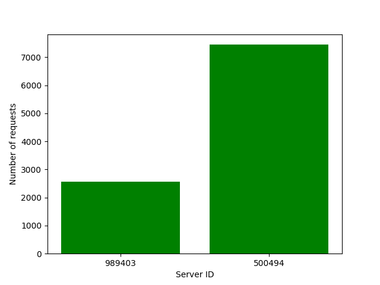
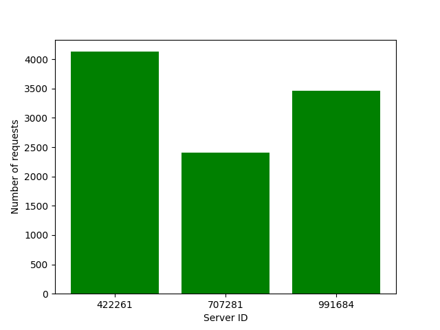
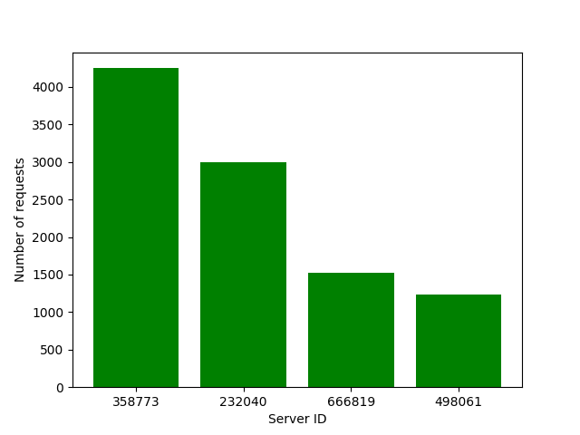
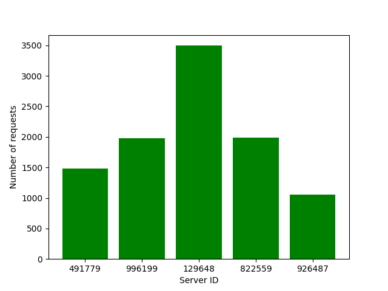
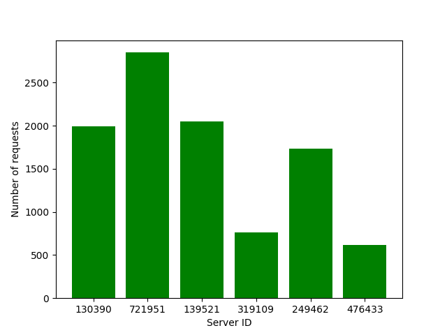

For the hash-functions:
phi(i, j) = i^2 + j^2 + 2*j + 25
H(i) = i*2 + 2*i + 17

On increasing the number of servers, the load balancing seemed to improve and a portion of the servers seemed to handle more of the load.

## A-3

## A-4

<!-- {'735386': 6598, '386925': 3402}
{'799024': 2307, '364428': 6740, '801449': 953}
{'248218': 4533, '811261': 2560, '621471': 1625, '694817': 1282}
{'958883': 893, '629242': 3709, '858846': 3089, '594252': 814, '456300': 1495}
{'275154': 1710, '965412': 2354, '589207': 1864, '465655': 3162, '678576': 701, '554001': 209} -->

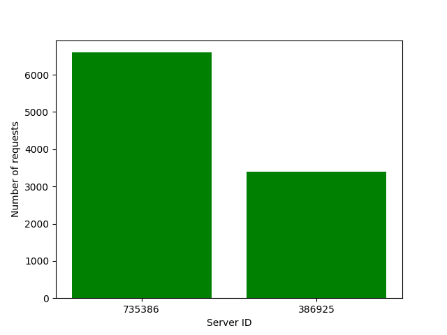
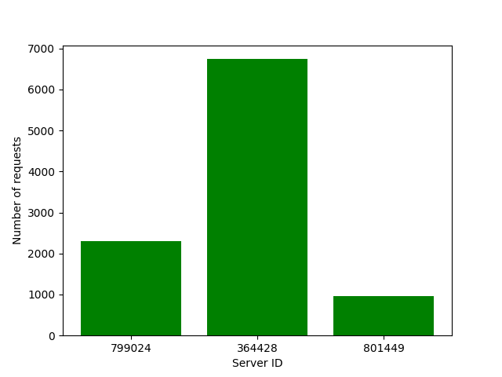
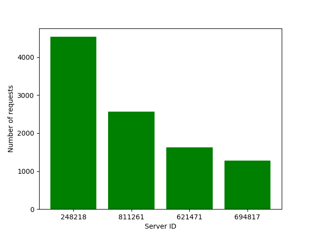
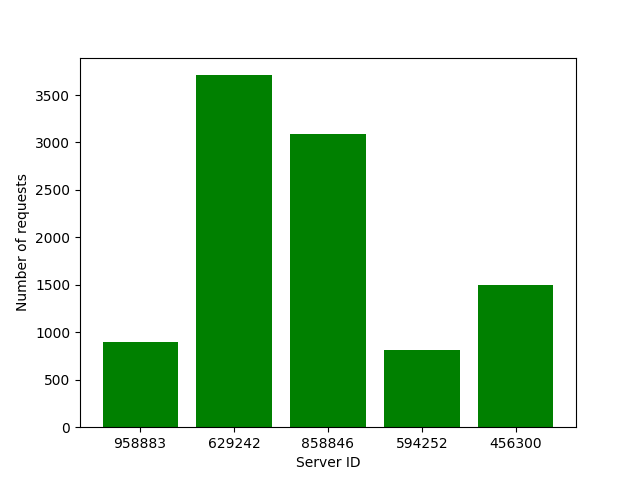
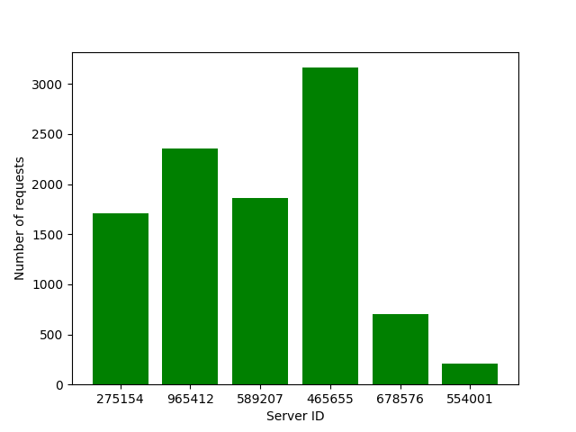

For the hash-functions:
phi(i, j) = i^3 + 2*i + 15*j + 17
H(i) = 5*i + 21

On increasing the number of servers, the load balancing improves and a portion of the servers seemed to handle more of the load.