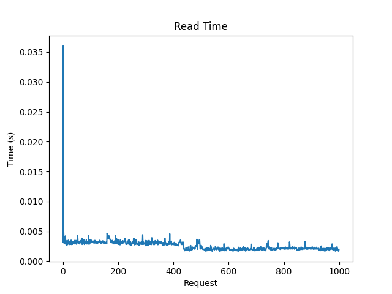
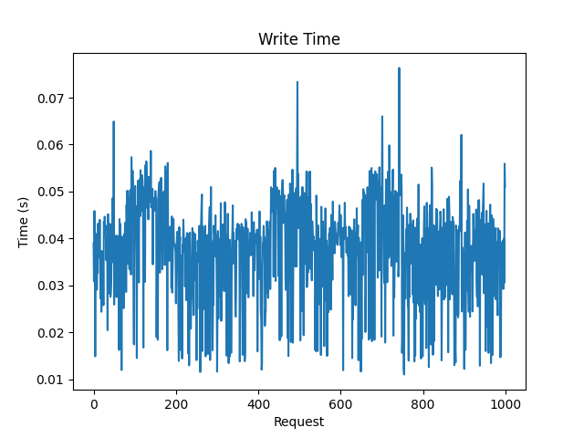
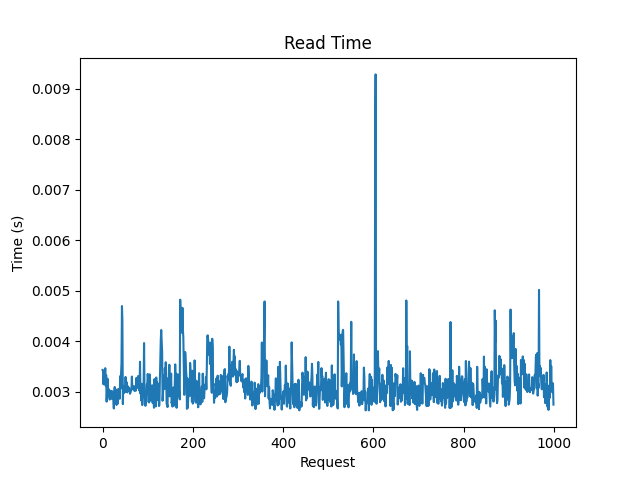
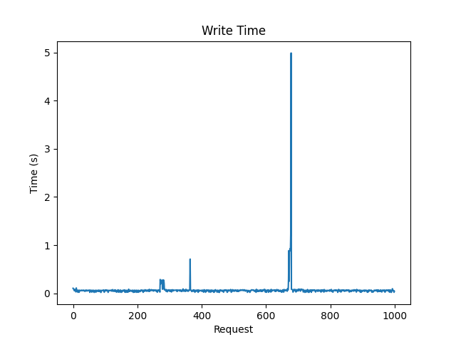
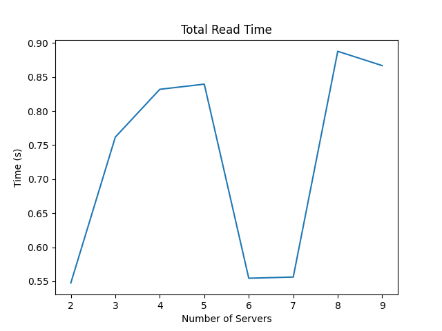
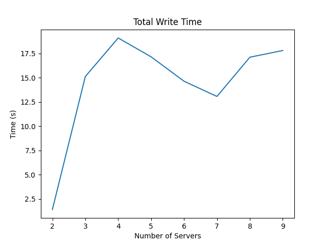
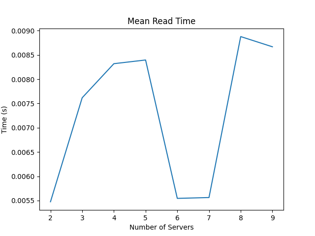
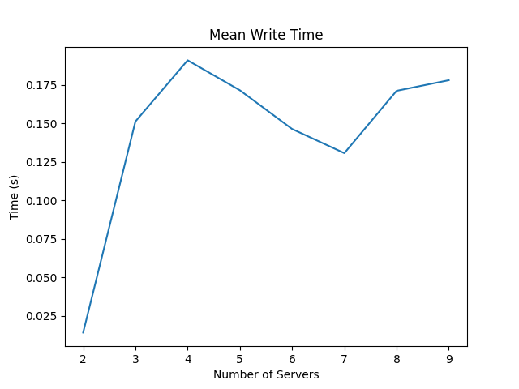
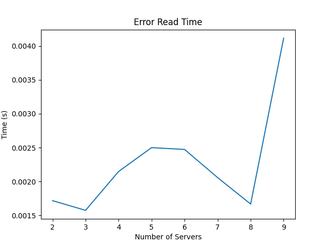
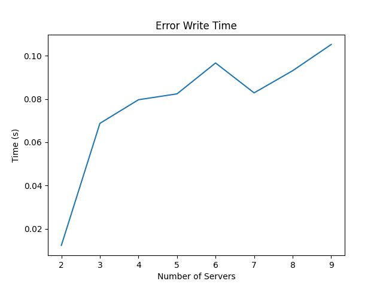

# Assignment 2

## Initial Setup

- Install Docker using the [official instructions](https://docs.docker.com/engine/install/ubuntu/)
- Navigate to `A2`
- Build the docker images using `docker compose build`

## Task-1: Server

- The server contains an `SQLHandler` class which handles all reads and writes to the database
- Dockerfile contains the `custom-entry.sh` script to initialize databases
- The internal mysql database has password set as 'abc'
- The docker-compose file contains port mapping from 5000 to 5000
- In order to run the server image, execute `docker compose up server` after building the images

## Task-2: Load Balancer
- The load balancer contains mutex locks for global metadata and for write, update, del routes
- Load Balancer is running on port `5000`
- In order to run the load balancer image, execute `docker compose up lb` after the images
- Load Balancer API endpoints are

    - `/init, method=POST`
        - This endpoint initializes the distributed database across different shards and replicas in the server containers
    - `/status, method=GET`
        - This endpoint sends the database configurations upon request
    - `/add, method=POST`
        - This endpoint adds new server instances in the load balancer to scale up with increasing client numbers in the system.
    - `/rm, method=DELETE`
        - This endpoint removes server instances from the load balancer to scale down with decreasing client numbers in the system.
    - `/read, method=GET`
        - Based on the consistent hashing algorithm, this endpoint reads data entries from the shard replicas across all server containers. 
    - `/write, method=POST`
        - This endpoint writes data entries in the distributed database.
    - `/update, method=PUT`
        - This endpoint updates data entries in the distributed database.
    - `/del, method=DELETE`
        - This endpoint deletes data entries from the distributed database.

### Design Choices
- Metadata storing the servers and shards information is stored in the load balancer and not in the database, so as to avoid the need to query the database for metadata information for every request. This is done to reduce the latency in the system.
- There are locks for the global metadata as well.
- The `config_server` function is used to setup shards inside the servers and has a sleep time of 90 sec. This is done to ensure that the heartbeat monitor thread starts the containers before a `/config` request is sent
- The load balancer uses consistent hashing to distribute the data across the shards and replicas. This is done to ensure that the data is uniformly distributed across the shards and replicas. Each shard has a corresponding Consistent Hashmap to it.
- When no placement of shards in servers in mentioned in `\init`, load balancer places shards taking replication factor as 3. 
- If new_shards are empty in `\add`, then replication is done and no new addition of shards.
- While writing if a server fails, then load balancer returns which server failed and the data is not written to the failed server.

## Task-3: Analysis

### A-1: 
**The read and write speed for 1000 writes and 1000 reads in the default configuration given in task 2**
- Total read time: 2.593085765838623  seconds
- Total write time: 37.91570973396301  seconds
- Average read time: 0.002593085765838623  seconds
- Average write time: 0.037915709733963014  seconds

    
    
    

    

### A-2: 
**The read and write speed for 1000 writes and 1000 reads when the number of shard replicas is increased (to 7) from the configuration (init endpoint)**
- Total read time: 2.1461596488952637  seconds
- Total write time: 68.46127414703369  seconds
- Average read time: 0.003146159648895264  seconds
- Average write time: 0.0684612741470337  seconds

    
    
    

**Note - Average Read Time decreased in A2 in comparison to A1 whereas Average Write Time increased in A2 in comparison to A1 due to increase in the number of the shard replicas.**

### A-3: 
**Increase the number of Servers (to 10) by adding new servers and increase the number of shards (shard to 6, shard replicas to 8). Define the (init endpoint) configurations according to your choice. Report the write speed up for 1000 writes and read speed up for 1000 reads.**

<!-- 

 -->